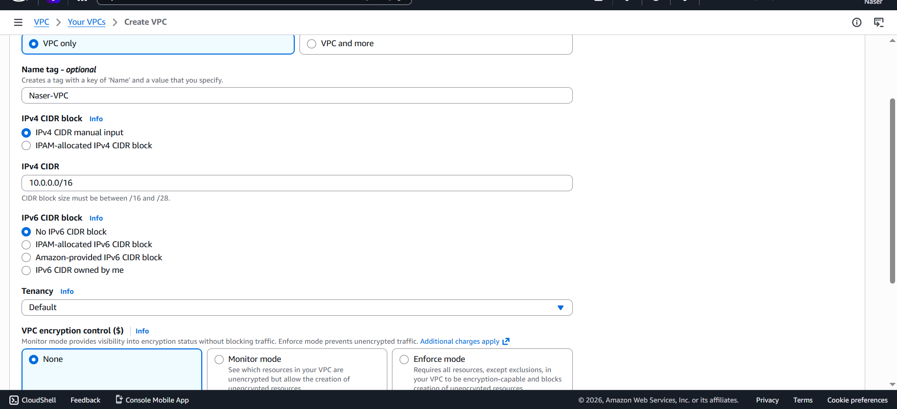
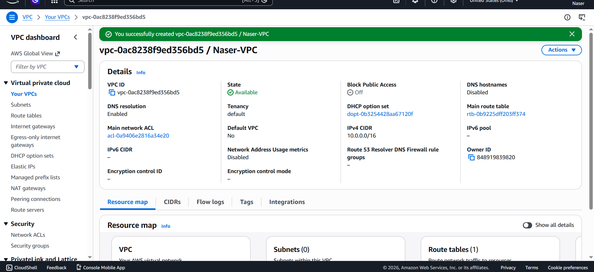
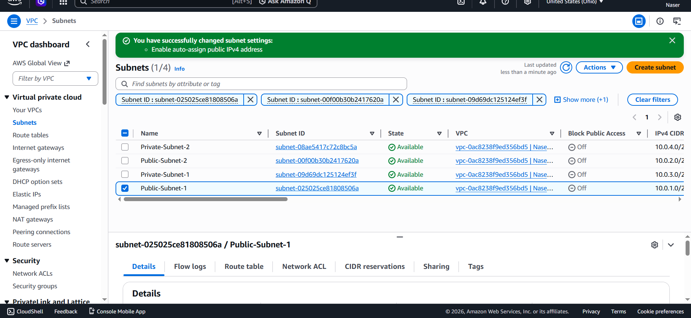
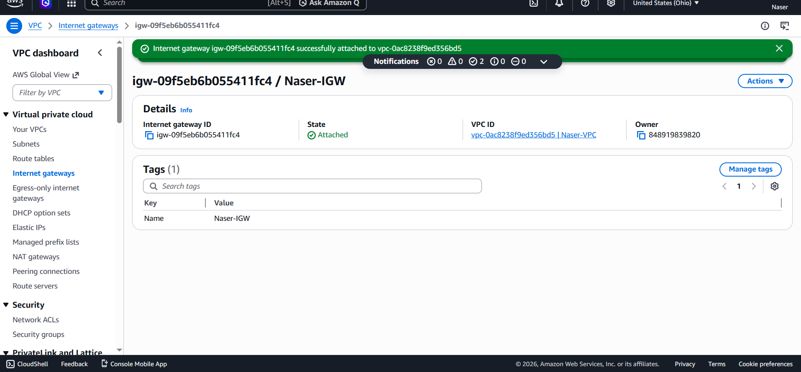
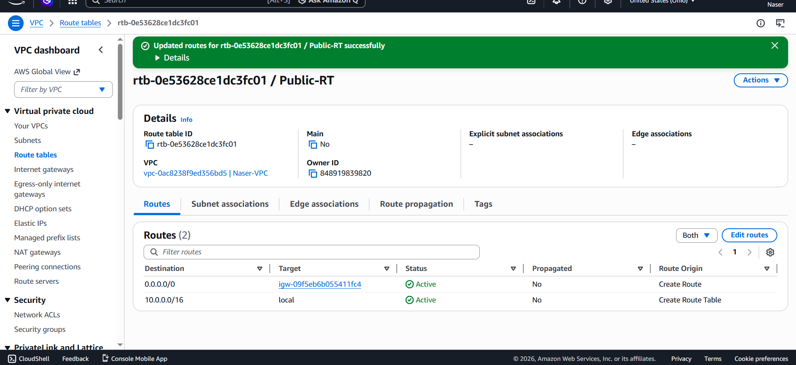

# ☁️ AWS High Availability Web Application

---

# 📌 Project Overview

This project demonstrates a secure and highly available AWS cloud architecture designed to host a web application using private EC2 instances behind an Application Load Balancer.

The infrastructure follows production-style cloud architecture practices including networking isolation, load balancing, auto scaling, and secure access through a Bastion Host.

---

# 🏗️ Architecture Components

## 🌐 Networking

* Custom VPC
* Public Subnets
* Private Subnets
* Internet Gateway
* NAT Gateway
* Route Tables

---

## 🔐 Security

* Security Groups
* Bastion Host
* Private EC2 Instances
* Restricted SSH Access

---

## ⚙️ Compute & Scaling

* EC2 Instances
* Launch Template
* Auto Scaling Group (ASG)

---

## 🚦 Load Balancing

* Application Load Balancer (ALB)
* Target Group
* Health Checks

---

## 🖥️ Web Server

* Ubuntu Server
* Nginx Web Server

---

# 🔄 Architecture Flow

Internet → Application Load Balancer → Private EC2 Instances

The Application Load Balancer distributes incoming traffic across private EC2 instances running Nginx in multiple Availability Zones.

---

# 🚀 Key Features

✅ High Availability Architecture
✅ Multi-AZ Deployment
✅ Private Infrastructure
✅ Load Balancing
✅ Auto Scaling
✅ Bastion Host Access
✅ Production-Style AWS Networking

---

# 🛠️ Technologies Used

* AWS VPC
* AWS EC2
* AWS Auto Scaling
* AWS Application Load Balancer
* AWS Security Groups
* Ubuntu Linux
* Nginx

---

# 📸 Project Screenshots

## 🌐 VPC Architecture

---

## 🚦 Load Balancer

---

## ❤️ Healthy Target Group

---

## 🖥️ Nginx Running Successfully

---

# 📚 What I Learned

Through this project I gained hands-on experience with:

* AWS Networking
* Public vs Private Subnets
* Linux Administration
* Bastion Host Architecture
* Load Balancers
* Auto Scaling Groups
* Cloud Security Basics

---

# 👨‍💻 Author

Naser
